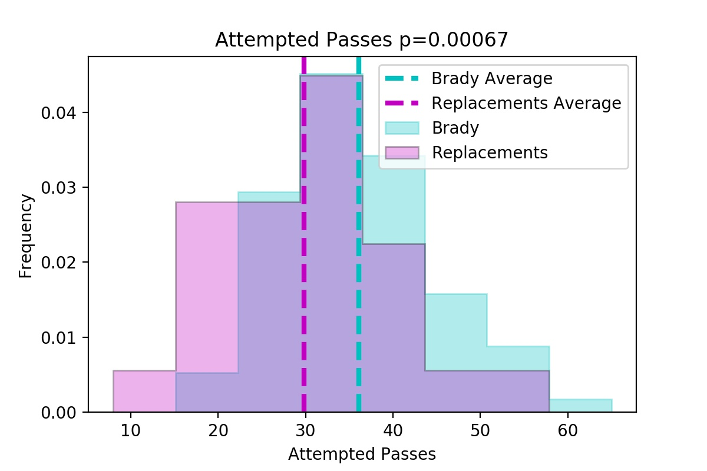
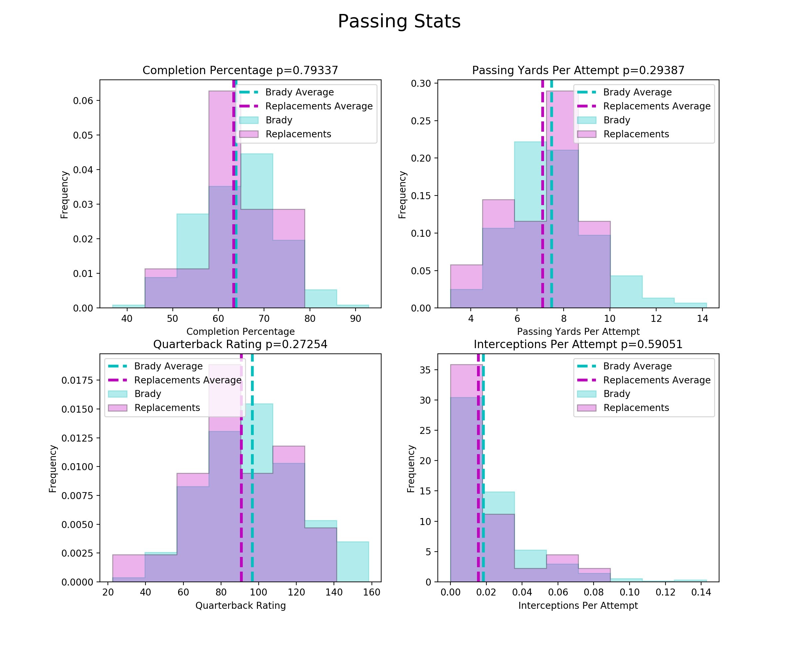
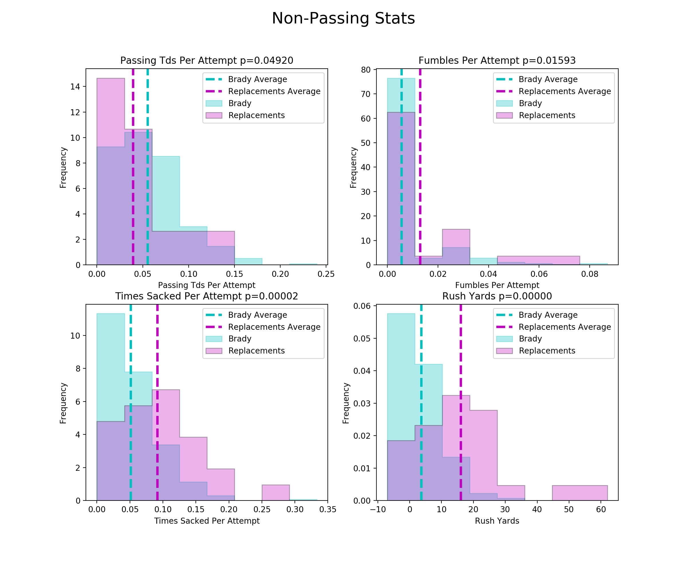

# The Replaceablity of Tom Brady (published on allthingsanalysis.com)

Tom Brady has lead the Patriots in nearly every single game since the start of the 2001 NFL season. Over those 19 year, Bill Belichick coached every game, and with 6 superbowl rings both are shoo-ins for the Hall of Fame. Nevertheless, the eternal debate still rages on daytime tv and local radio of who deserves more credit for the Patriots' historic run: Brady or Belichick. Since Brady has taken his talents to Tampa Bay to work with Bruce Arians, all the pieces are in place for the 2020 NFL season to serve as an experiment, however flawed, that will be used to reevaluate the legacies of the former allies.
This article will focus on how the Patriots will fare without their GOAT. For an outlook on the Bucs' 2020 season, check out this article out.
Since 2001, Tom Brady has been the primary quarterback, as measured by total pass attempts, in 320 games, holding that title in all but 25 games. Drew Bledsoe led the first two games in 2001 and replaced Brady after a midgame injury in the 2001 AFC Championship game. Matt Castle played in a week 17 game in 2006 and all 16 games in 2008 after Brady tore his ACL. Jimmy Garoppolo played in a week 17 game in 2014, and Jimmy G and Jacoby Brissett each played two games while Brady was serving his deflategate suspension in 2016. With replacements, the Patriots went a solid 16-9 (winning 64.0%). A solid performance, but with Brady, the Pats' record stands at 247-73 (winning 77.4%). How do the stats explain Brady’s win percentage advantage over his replacements, and what does this mean we can expect from Brian Hoyer or Jarrett Stidham in 2020?
#### Comparison of Passing Stats

Through his career, Brady threw an average of 36.1 passes per game, while other his replacements threw an average of 29.8 passes. A two sample t-test comparing the difference in total passes between these groups has a p-value 0.00067, well below the 0.05 threshold, indicating the difference between the two groups is statistically significant. The finding that Brady's replacements have throwing less passes per games can be explained in many ways: more conservative play calling, less offense success leading to less total plays, and the higher likelihood of a replacement to play a partial games as an injury substitute all seem valid. Regardless of the cause, the upcoming stats are normalized to passes thrown to mitigate the effects of this variable.

#### Comparison of Non-Passing Stats
Surprisingly, after normalization, Brady’s passing numbers are nearly indistinguishable from his replacements. Brady's stats are better in all cases, with the exception of interceptions, but his advantage is rarely statistically significant. Brady's completion percentage is less than 1 percentage point higher, his passing yards per attempt is less than a yard better, and his quarterback rating is only 6 points higher than his replacements.

One passing stat that Brady holds a distinct advantage in is passing touchdowns per attempt. This may be more a testament to his ability to keep drives alive rather than this throwing ability. Brady outclasses his replacements in non-passing stats. Per pass attempted, roughly the equivalent to per passing play, Brady was about half as likely to take a sack, and less than half as likely to fumble. In both categories, Brady's edge is extremely statistically significant, and this is what leads to Brady's higher win percentage rather than passing performance. Not surprisingly, Brady's replacements have averaged significantly more rush yards per game.
#### 2020 Season Predictions
As of June 2020, the Patriots 2020 win total over/under is 9 on Bovada with the over paying (+110). This time last year, the Patriots win total over/under was 11, and it paid out (-140). Based on this analysis, I expect the Patriots to continue their ~64% win percentage without Brady and win more than 9 games (+110). For fantasy, Sony Michelle and James White should have good value due to the high likelihood of conservative play calling and a checkdown passes. I predict the either Patriots QB will average 210 yards and 1.2 touchdowns per game.
2020 won't provide definitive answers for the Bill vs. Brady debate, but both guys know the impact this year will have on how they are remembered.
